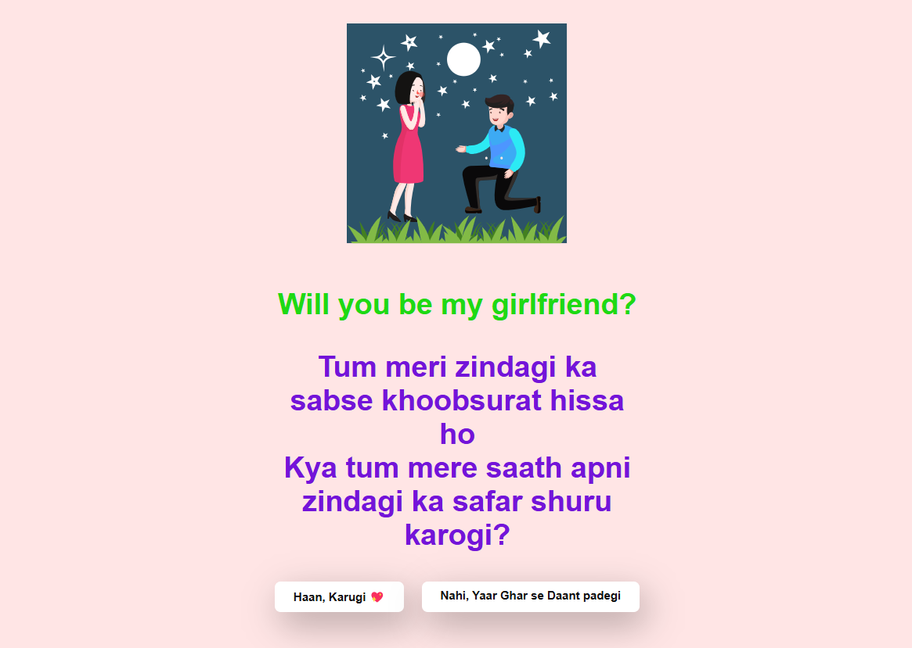
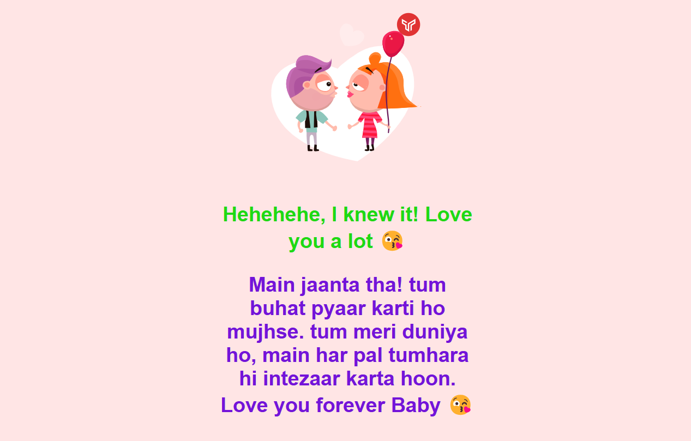
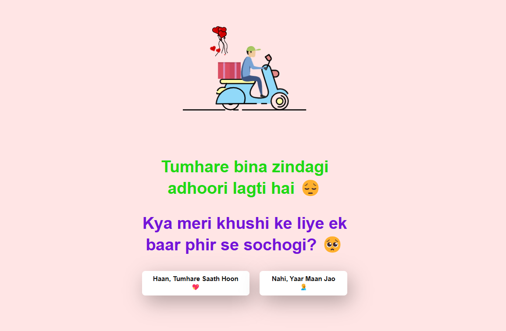
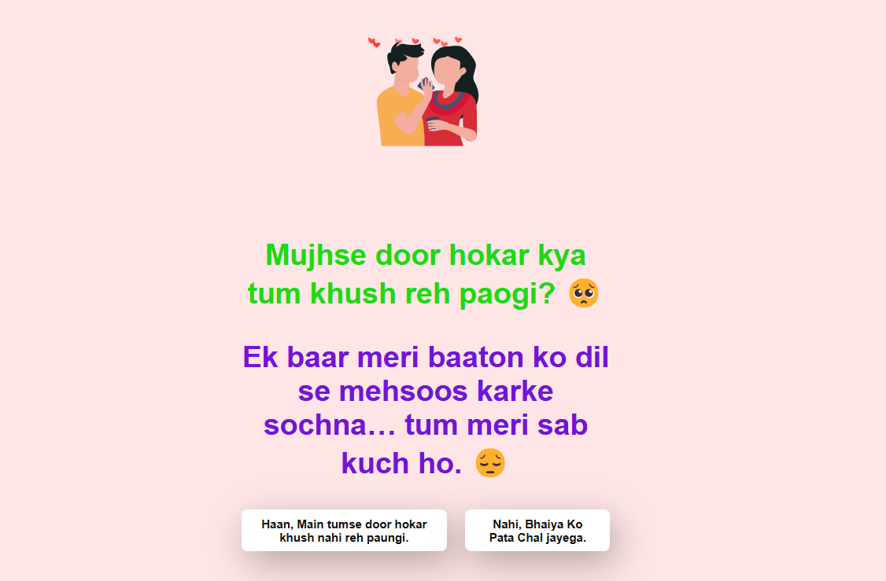
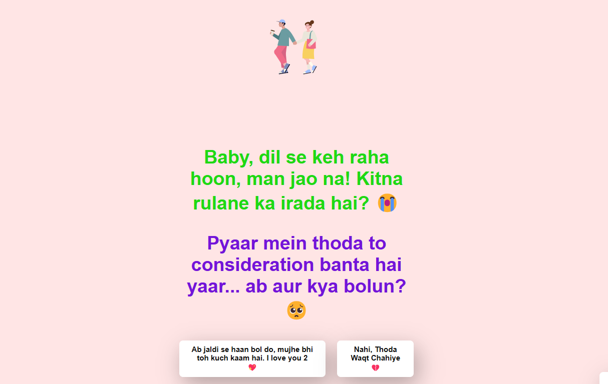
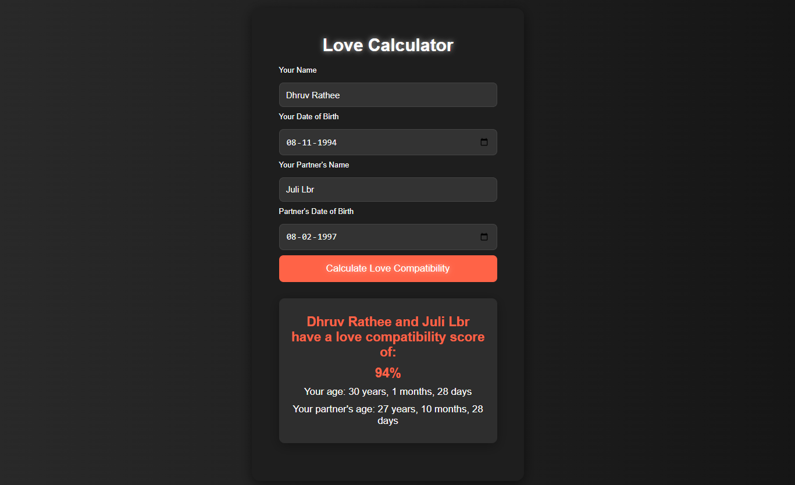

# Love Proposal Project

This project is a series of HTML pages designed to create an interactive love proposal experience. The main page asks the user if they will be the author's girlfriend, and depending on their response, they are redirected to different pages with further interactions.

## Project Structure

- `index.html`: The main proposal page.
- `yes.html`: The page displayed if the user accepts the proposal.
- `no1.html`, `no2.html`, `no3.html`: Pages displayed if the user initially rejects the proposal, with each page providing a different message and further options.
- `cry.html`: A page that can be accessed from `no3.html` to start the love journey.
- `style.css`: The main stylesheet for the project.
- `script.js`: JavaScript file to handle interactive elements.
- `love.css`: Additional stylesheet for specific pages.
- `hate.js`: JavaScript file for calculating love compatibility.

## How It Works

1. **Main Proposal Page (`index.html`)**:
    - Displays a proposal message with two options: "Haan, Karugi 💖" and "Nahi, Yaar Ghar se Daant padegi".
    - If the user clicks "Haan, Karugi 💖", they are redirected to `yes.html`.
    - If the user clicks "Nahi, Yaar Ghar se Daant padegi", they are redirected to `no1.html`.

2. **Rejection Pages (`no1.html`, `no2.html`, `no3.html`)**:
    - Each page displays a different message and provides further options.
    - The user can either accept the proposal and be redirected to `yes.html`, or continue rejecting and be redirected to the next rejection page.
    - `no3.html` includes an additional option to start the love journey by redirecting to `cry.html`.

3. **Acceptance Page (`yes.html`)**:
    - Displays a message of acceptance and love.

4. **Love Journey Page (`cry.html`)**:
    - Provides a link to start the love journey.

## Installation and Usage

1. Clone the repository:
    ```sh
    git clone https://github.com/imtahirnaseer/Love-Proposal.git
    ```

2. Open the project directory:
    ```sh
    cd Love-Proposal
    ```

3. Open [index.html](http://_vscodecontentref_/0) in your web browser to start the interactive experience.

## Dependencies

- [@dotlottie/player-component](https://unpkg.com/@dotlottie/player-component@2.7.12/dist/dotlottie-player.mjs): Used for displaying Lottie animations.

## Screenshots

### Main Proposal Page (`index.html`)


### Acceptance Page (`yes.html`)


### Rejection Page 1 (`no1.html`)


### Rejection Page 2 (`no2.html`)


### Rejection Page 3 (`no3.html`)


### Love Journey Page (`cry.html`)


## Live Demo

Check out the live demo of the project [Live Demo](https://imtahirnaseer.github.io/Love-Proposal).

## License

This project is licensed under the MIT License. See the LICENSE file for details.

---

Feel free to customize the messages and styles to better suit your needs. Enjoy your interactive love proposal experience!
